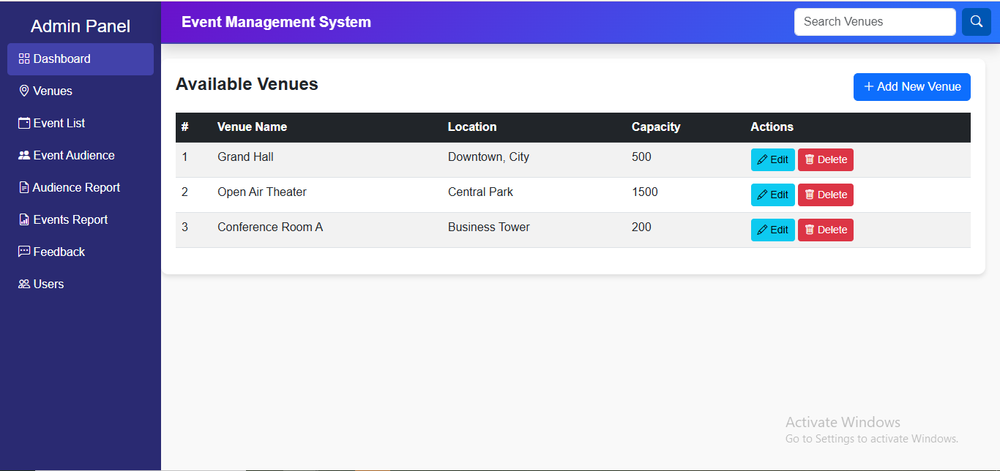
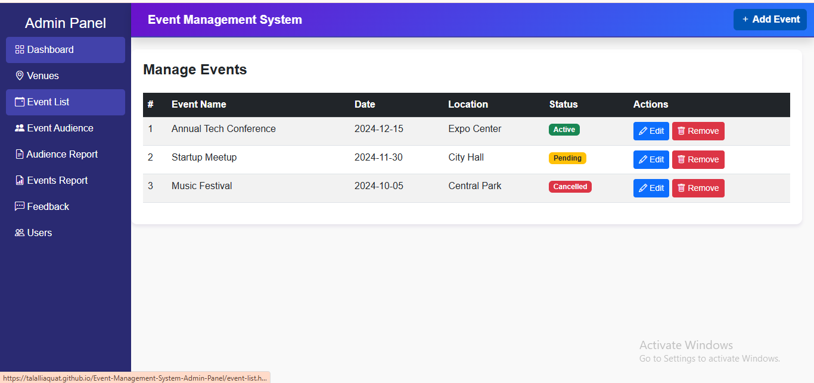
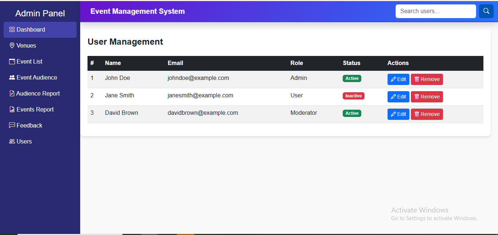

# 🎉 Event Management System - Admin Panel

This is a simple **Admin Panel** for an **Event Management System** built using **HTML, CSS, and Bootstrap**.  
It provides a responsive interface to manage events, participants, and categories efficiently.  

---

## 🚀 Features
- 📅 Add, Edit, Delete Events  
- 👥 Manage Participants  
- 📂 Event Categories  
- 🎨 Responsive Design (Bootstrap 5)  
- 📊 Dashboard Layout with Cards & Tables  

---

## 📷 Screenshots  

### 1. Dashboard View  
  

### 2. Events List  
  

### 3. Participants Management  
  

### 4. User Management  
 

---

## 🌐 Live Demo  
🔗 [Click here to view the project](https://talalliaquat.github.io/Event-Management-System-Admin-Panel/)  

--- 

## ⚡ Installation & Run  

1. Clone the repository:
   ```bash
   git clone https://github.com/TalalLiaquat/Event-Management-System-Admin-Panel.git
   cd Event-Management-System-Admin-Panel
Open the project folder and run index.html in your browser.

✅ That’s it! No extra installation needed because this project is built with pure HTML, CSS & Bootstrap.

📂 Project Structure
pgsql
Copy code
Event-Management-System-Admin-Panel/
│── index.html
│── events.html
│── participants.html
│── categories.html
│── css/
│    └── style.css
│── js/
│    └── script.js
│── screenshots/
│    └── 1.png
│    └── 2.png
│    └── 3.png
🚧 Future Enhancements
🔐 Add authentication for Admin

📊 Add analytics dashboard with charts

🌐 Connect with backend (PHP/Node.js + Database)

📱 Improve mobile-friendly design

✨ Author
👤 Talal Liaquat
📌 Student of Computer Science | Exploring Web Development & Event Management Systems

💼 LinkedIn: linkedin.com/in/talalliaquat


## 📜 License

This project is licensed under the MIT License
